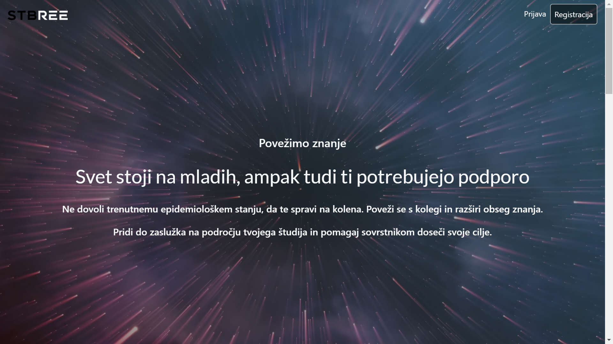
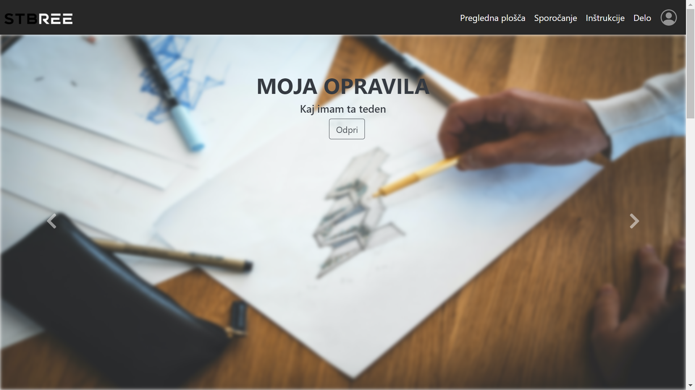
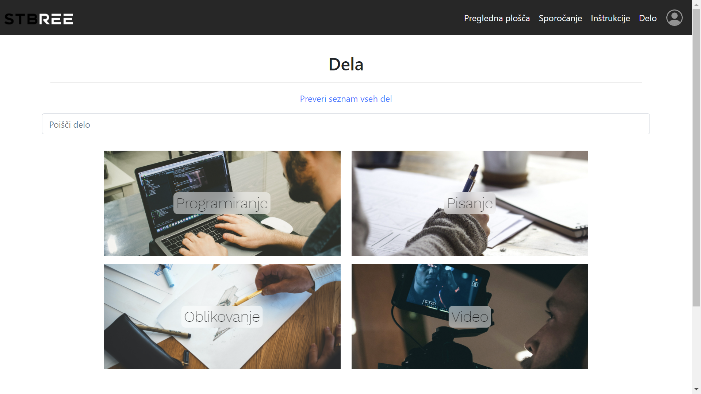
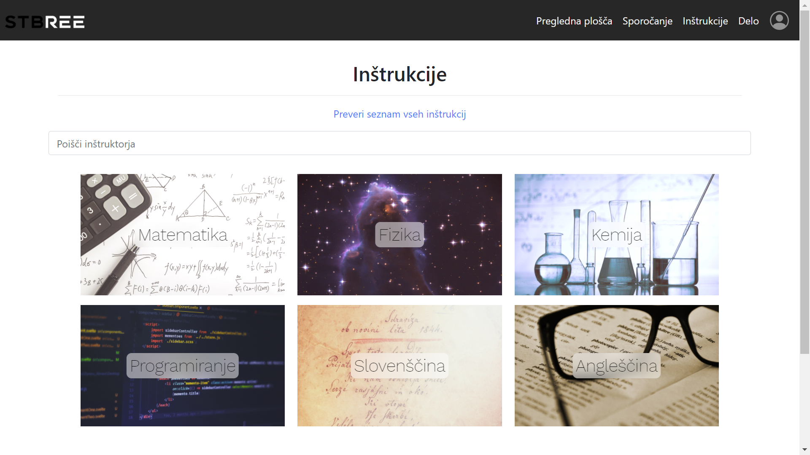
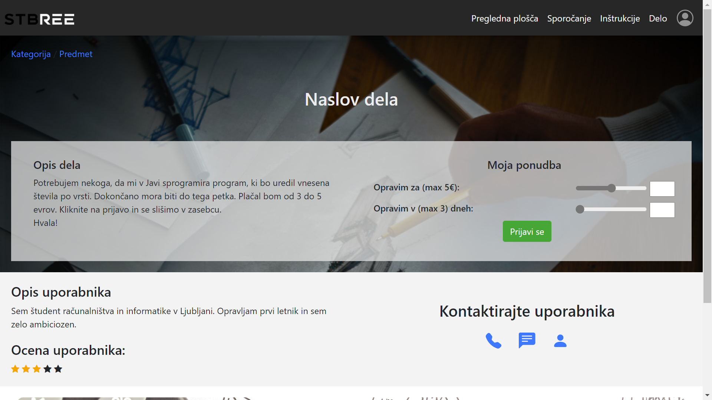
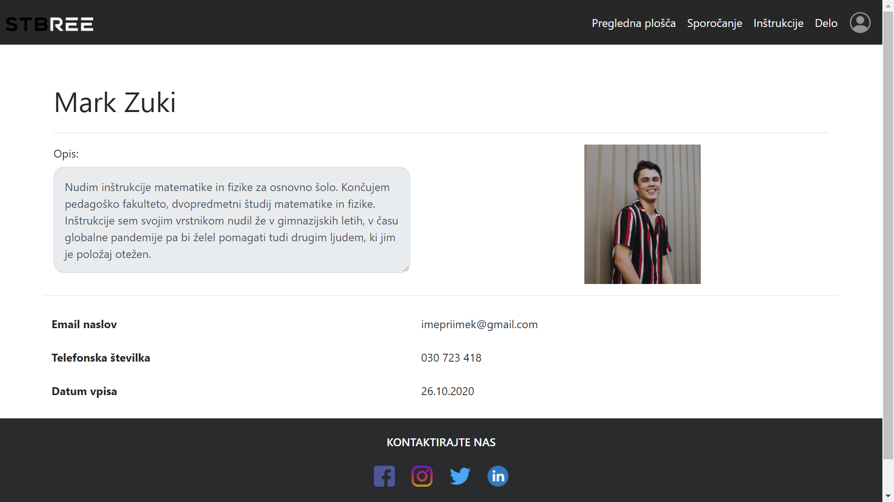
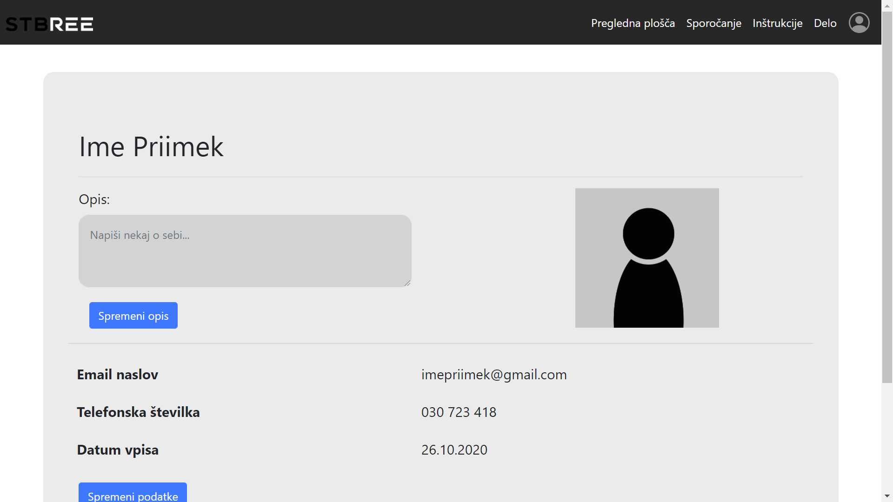
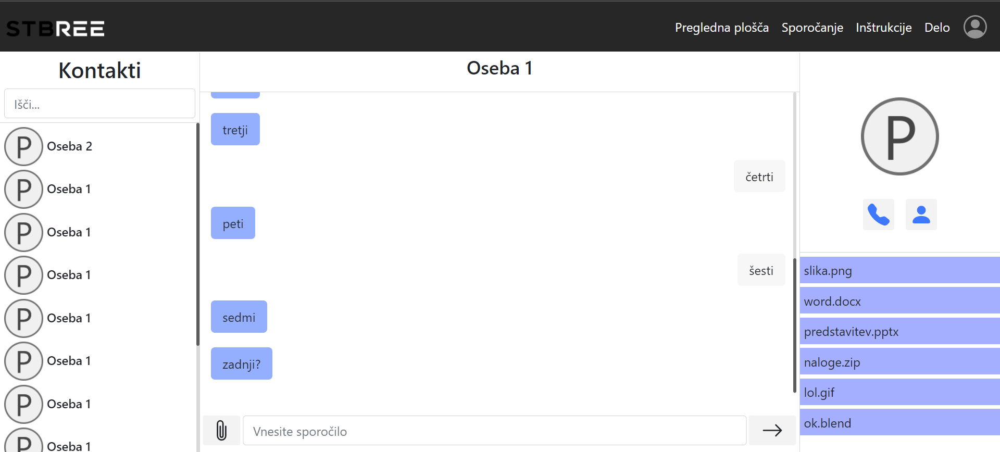
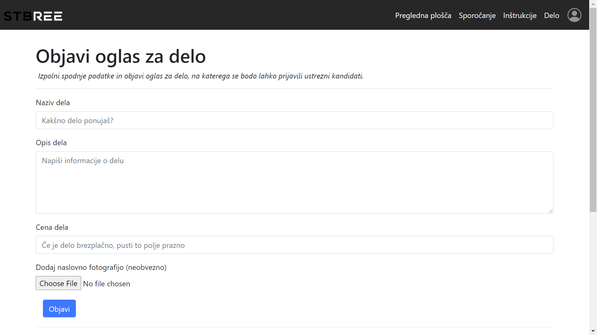
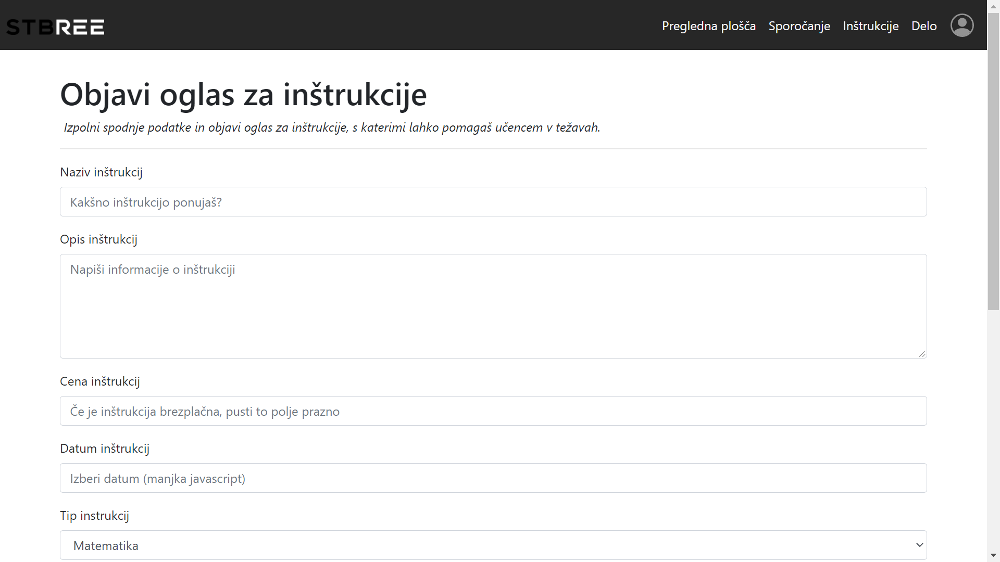

# Spletno programiranje 2020/2021

Dokumentacija lastnega projekta pri predmetu **Spletno programiranje** v študijskem letu **2020/2021**.

**UVOD**

Skupina 27 si je pri predmetu spletno programiranje zadala izdelavo spletne aplikacije, ki bo študentom olajšala preživljanje epidemioloških časov in lažje opravljanje študija.

## 1. LP

Osnutek aplikacije in wireframe model:

Začetna stran index.html nam na kratko predstavi našo rešitev ter ponuja povezavo na pregled vsebine brez registracije. Prav tako je na voljo dostop do prijave v račun oz. ustvarjanja novega.

Pregledna plošča je glavna stran iz katere lahko dostopamo do izbire del, inštrukcij, naših opravil ter vseh povezav, dostopnih v navigacijskem meniju. Tukaj bo prikazano tudi trenutno epidemiološko stanje, ki bo implementirano preko API.

Uporabnik se lahko prijavi na delo ali na inštrukcije. Izbira med več kategorijami, ki ga peljejo na seznam izbire.

Ponujeno delo si lahko tudi podrobneje ogleda in se najn prijavi s svojo ponudbo. Vsak inštruktor ima svoj profil, na iz katerega lahko razberemo kakšno znanje nudi.

Svoj profil je mogoče urejati. Uporabniki lahko prejmejo oceno ter komentarje, ki so pokazatelj zvestobe in znanja. (prikaz le-teh še ni implmentiran)

S ponudnikom lahko uporabnik stopi v kontakt preko neposrednega sporočanja ali ustvari povezavo za Zoom sestanek (ni še implementirano).

Vsak uporabnik se lahko odloči postati inštruktor. Prav tako je vsakemu uporabniku omogočena objava oglasa za delo.

